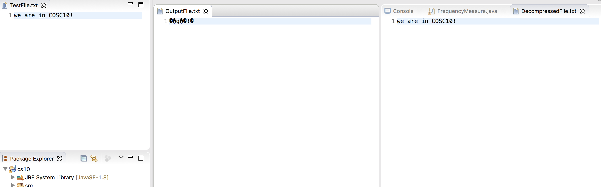

# Huffman Encoding

## Description
As the name would suggest, this program utilizes Huffman Encoding for file compression and decompression.
The process of Huffman encoding produces prefix-free codes, which means that for any given code word, it adds bits to the end, which cannot produce a different code word. Essentially, no code word is a prefix of another.
The general implementation of this program is as follows: character frequency table is generated, tree is created based on these frequencies, and the code can be retrieved.

## Demo

